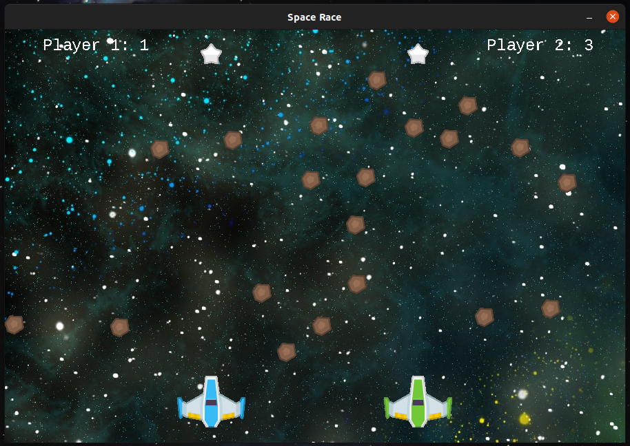

# Space Race

It's a simple space race inspired in the arcade retro game. [Image](https://upload.wikimedia.org/wikipedia/en/0/05/Space_Race_gameplay.png)

Assets credit: [Kenney.nl](https://kenney.nlnl/)

## Screenshot

## Installation
With python v3.x running in your pc and if you want to install the dependencies using the requirements.txt:

    python -m venv .

On Unix or MacOS, using the bash shell: 

    source /path/to/venv/bin/activate

On Windows using the Command Prompt: 

    path\to\venv\Scripts\activate.bat

Managing packages in virtual environments

    pip3 install -r requirements.txt.

## Controls
### For Player 1:
    To move paddle up press 'w'
    To move paddle down press 's'

### For Player 2:
    To move paddle up press 'UP_ARROW'
    To move paddle down press 'DOWN_ARROW'

## Dependencies required: 
    * Python v3.x
    * Pygame v2.x 
